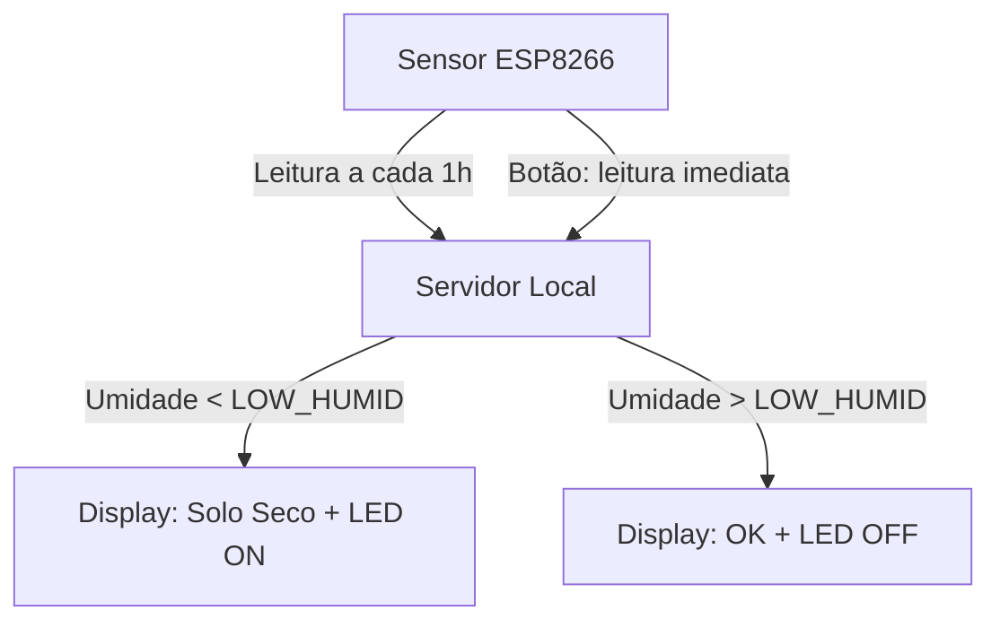

# 🌿 HomePlant Monitor

**Sistema de monitoramento IoT para plantas residenciais**

O **HomePlant Monitor** é um projeto de Internet das Coisas (IoT) projetado para monitorar a saúde das plantas em uma residência. Utilizando sensores conectados, displays de notificação e um servidor local, o sistema ajuda o usuário a manter suas plantas sempre bem cuidadas, notificando automaticamente quando o solo estiver seco.

---

## 📦 Componentes do Sistema

### 🛰️ Sensores (ESP8266)

Dispositivos compactos baseados em ESP8266 que são instalados diretamente nos vasos das plantas. Eles realizam a leitura dos seguintes dados:

- 🌡️ **Temperatura ambiente**
- 💧 **Umidade do solo**

**Características:**

- Alimentação via baixa voltagem (5V a 12V)
- Envio automático de dados ao servidor a cada **1 hora**
- Botão físico para envio imediato de leitura
- Comunicação via Wi-Fi com o servidor local

---

### 📺 Displays de Alerta

Dispositivos responsáveis por **exibir mensagens e acionar LEDs** quando o servidor detecta solo seco ou quando a umidade volta ao normal.

**Características:**

- Comunicação contínua com o servidor via rede local
- Tela integrada para mensagens de alerta
- LEDs indicadores de solo seco (aviso visual)

---

### 🖥️ Servidor Local

Responsável por centralizar os dados dos sensores e coordenar os displays.

**Características:**

- Executado via Docker
- Roda 100% na **intranet residencial** (sem necessidade de internet)
- Avalia os dados recebidos e compara com o limiar `LOW_HUMID`
- Gera **eventos de alerta** para os displays:
  - Quando a umidade do solo fica **abaixo do limite**
  - Quando a umidade volta ao **nível aceitável**
- Expõe uma API REST local (futuramente Web UI opcional)

---

## ⚙️ Instalação

### 1. Clonar o repositório

```bash
git clone https://github.com/seu-usuario/homeplant-monitor.git
cd homeplant-monitor
```

### 2. Configurar variáveis de ambiente

Crie um arquivo `.env` com os seguintes parâmetros:

```env
LOW_HUMID=30      # Limiar de umidade mínima (%)
READ_INTERVAL=3600 # Intervalo entre leituras dos sensores (segundos)
```

### 3. Subir o servidor com Docker

```bash
docker compose up -d
```

---

## 📡 Fluxo de Dados



---

## 🛠️ Tecnologias Utilizadas

- **ESP8266** (Plataforma dos sensores)
- **Docker + Docker Compose** (Servidor local)
- **REST API** para comunicação entre dispositivos
- **MQTT** (opcional, para melhorar a eficiência da rede)
- **C/C++ (Arduino)** nos sensores
- **Python / Node.js** no servidor (definir conforme implementação)

---

## 📅 Roadmap

- [x] Leitura periódica dos sensores
- [x] Notificação por botão físico
- [x] Displays com alertas visuais
- [x] Servidor local com Docker
- [ ] Painel Web para visualização de dados
- [ ] Histórico de leituras
- [ ] Integração com assistentes de voz (ex: Alexa)

---

## 🤝 Contribuindo

Contribuições são bem-vindas! Sinta-se à vontade para abrir issues, sugerir melhorias ou enviar pull requests.

---

## 📄 Licença

Este projeto está licenciado sob a [MIT License](LICENSE).

---

## 🌱 Feito com carinho para plantas felizes.